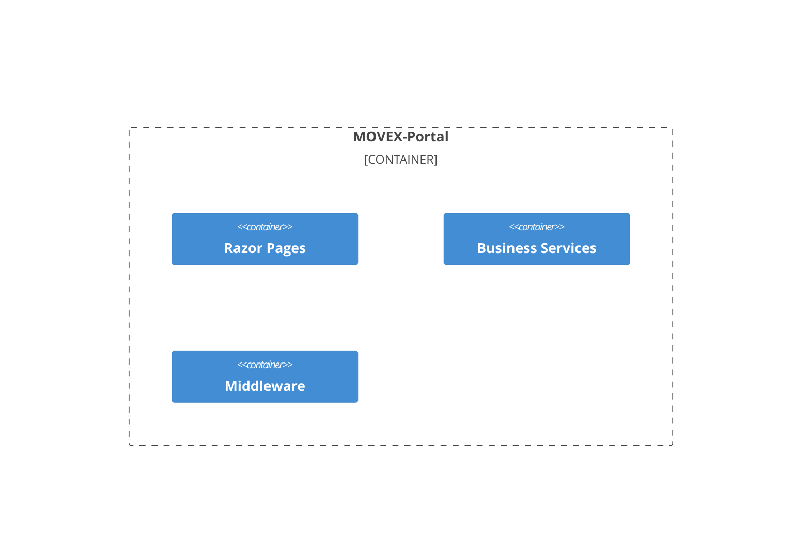
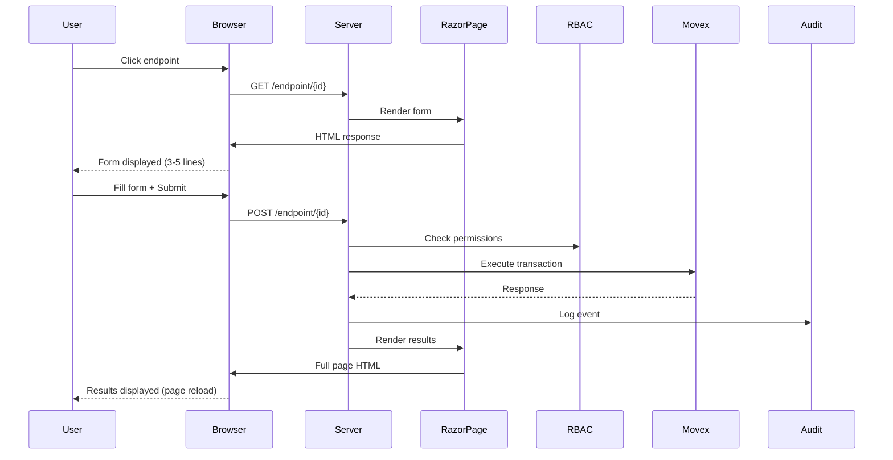
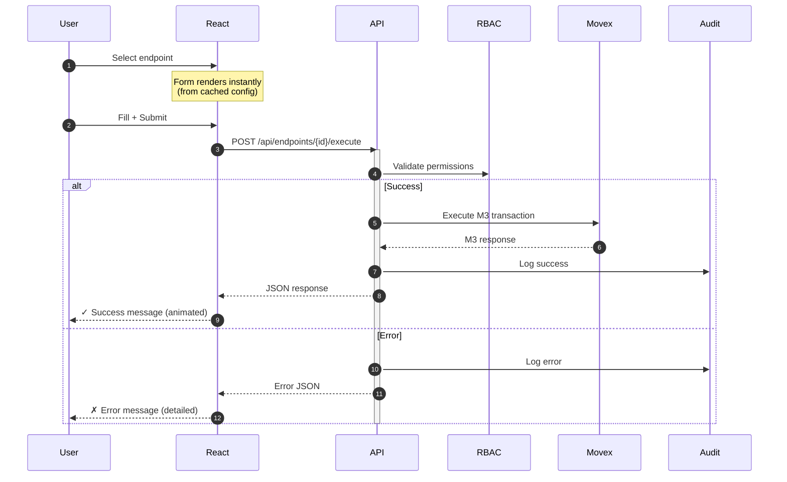

# Change Impact 001: Architecture Diagrams Update

**Date**: February 4, 2026  
**Related Decision**: [Decision-001: React SPA Architecture](decision-001-react-spa-architecture.md)  
**Impact Level**: MEDIUM (Documentation update, no code changes yet)

---

## Summary

Updated all Mermaid C4 diagrams in [02-system-architecture.md](../memory/02-system-architecture.md) to reflect the transition from monolithic Razor Pages application to separated React SPA + ASP.NET API architecture.

---

## Changes Made

### 1. System Context Diagram

**Before**: Single "MOVEX-Portal (Web Application)" container
```mermaid
C4Context
    Person(users, "Internal Users", "Staff needing M3 access")
    System(portal, "MOVEX-Portal", "Web Application")  ← Monolithic
    System_Ext(ad, "Active Directory")
    System_Ext(movex, "MOVEX REST API")
    System_Ext(db2, "Db2 iSeries")
```

**After**: Separated "React Web App" + "ASP.NET Core API"
```mermaid
C4Context
    Person(users, "Internal Users", "Staff needing M3 access")
    System(webapp, "React Web App", "Material-UI SPA")     ← Frontend
    System(api, "ASP.NET Core API", "RESTful backend")     ← Backend
    System_Ext(ad, "Active Directory")
    System_Ext(movex, "MOVEX REST API")
```

**Impact**: Clarifies architectural separation, shows API-first approach

---

### 2. Container Diagram

**Before**: Single boundary with Razor Pages, ViewModels, Services


**After**: Separate Frontend and Backend boundaries with color coding
```mermaid
C4Container
    Container_Boundary(frontend, "Frontend") {
        Container(ui, "Material-UI", "React components") {
            style ui fill:#1976d2,color:#fff
        }
        Container(redux, "Redux Store", "Global state")
        Container(query, "TanStack Query", "Server cache")
    }
    
    Container_Boundary(backend, "Backend") {
        Container(controllers, "API Controllers") {
            style controllers fill:#4caf50,color:#fff
        }
        Container(rbac, "RBAC Middleware")
        Container(audit, "Audit Middleware")
    }
```

**Impact**: Visual separation of concerns, clearer component relationships

---

### 3. Component Architecture

**Before**: Layered Razor Pages architecture
```
Presentation Layer
    ├─ Razor Pages (.cshtml)
    ├─ Tag Helpers
    └─ View Models

Business Layer
    ├─ Services
    └─ Validators

Data Access Layer
    └─ Repositories
```

**After**: React SPA + ASP.NET API separation
```
FRONTEND (React SPA)
    Components/
        ├─ Layout/
        │   ├─ AppBar (top navigation)
        │   ├─ Sidebar (menu)
        │   └─ MainLayout
        ├─ Endpoints/
        │   ├─ EndpointGrid
        │   └─ EndpointCard
        └─ Forms/
            ├─ DynamicForm
            └─ ResultsPanel

    State Management/
        ├─ Redux (auth, config, UI state)
        └─ TanStack Query (server data)

BACKEND (ASP.NET Core API)
    Controllers/
        ├─ EndpointsController
        ├─ ExecuteController
        └─ AuditController

    Middleware/
        ├─ JWT Authentication
        ├─ RBAC Enforcement
        └─ Audit Logging
```

**Impact**: Clarifies separation of frontend/backend responsibilities

---

### 4. Data Flow Sequence Diagram

**Before**: 18-step Razor Page flow with page reloads


**After**: 8-10 step React SPA flow with error handling


**Impact**: Clearer flow, shows error handling, demonstrates SPA performance

---

### 5. Technology Stack Section

**Before**:
```markdown
### Technology Stack

- **Framework**: ASP.NET Core 8.0 (Razor Pages)
- **UI**: Bootstrap 5.3
- **JavaScript**: jQuery (minimal)
- **Authentication**: Windows Integrated Auth
- **Logging**: Serilog
```

**After**:
```markdown
### Technology Stack

**Frontend:**
- React 18 (UI library)
- TypeScript 5 (type safety)
- Material-UI 5 (component library)
- Redux Toolkit (global state)
- TanStack Query (server state)
- React Router v6 (routing)
- Axios (HTTP client)
- Vite (build tool)

**Backend:**
- ASP.NET Core 8.0 (RESTful API)
- C# 12
- Serilog (logging)
- FluentValidation (input validation)
- Dapper (SQL micro-ORM for audit)

**Infrastructure:**
- IIS 10 (hosting)
- Windows AD (authentication)
- SQL Server 2019 (audit logs)
- JWT (stateless auth tokens)
```

**Impact**: Comprehensive stack visibility, clear frontend/backend separation

---

## Diagram Quality Improvements

### Issues Fixed
1. **Layout problems**: Shortened descriptions using `<br/>` for line breaks
2. **Overlapping text**: Reduced relationship count at System Context level
3. **Unclear boundaries**: Added separate Frontend/Backend boundaries
4. **Missing colors**: Added color coding (blue for React, green for ASP.NET)
5. **No error paths**: Added `alt` blocks for error handling in sequence diagrams

### Best Practices Applied
- Concise descriptions (max 3 words per line)
- Visual separation with boundaries
- Color coding for component types
- Numbered sequence steps (autonumber)
- Error handling paths (alt/else blocks)
- Annotations for timing/performance notes

---

## Files Modified

### `ai/memory/02-system-architecture.md`
- **Lines 1-80**: Updated introduction to mention React + Material-UI
- **Lines 85-150**: Replaced System Context diagram
- **Lines 155-230**: Replaced Container diagram
- **Lines 290-350**: Updated component architecture section
- **Lines 400-500**: Replaced data flow sequence diagram
- **Lines 550-600**: Updated technology stack section
- **Lines 605-650**: Added "Why React + Material-UI?" section

---

## Affected Stakeholders

| Stakeholder | Impact | Action Required |
|-------------|--------|-----------------|
| **Development Team** | Medium | Review new architecture diagrams, understand React + API separation |
| **Operations Team** | Low | Note deployment will be 2 artifacts (React build + API), same IIS |
| **Business Users** | None | Diagrams are internal documentation |
| **Security Team** | Low | Review updated security flow (JWT instead of session cookies) |

---

## Rollback Plan

If React architecture is rejected, revert `02-system-architecture.md` to show:
- Single MOVEX-Portal container (not separated React + API)
- Razor Pages component architecture
- Original 18-step sequence diagram
- Original Razor Pages + Bootstrap technology stack

Git commit for rollback: `[commit-hash-before-changes]`

---

## Validation Checklist

- [x] All Mermaid diagrams render correctly in VS Code
- [x] System Context shows clear separation (React Web App + ASP.NET API)
- [x] Container diagram has visual boundaries (Frontend/Backend)
- [x] Component architecture reflects React + API structure
- [x] Data flow sequence includes error handling
- [x] Technology stack lists all frontend and backend dependencies
- [x] No broken links in updated documentation
- [x] Diagrams align with [Decision-001](decision-001-react-spa-architecture.md)

---

## Next Steps

1. Obtain approval for Decision-001 (React architecture)
2. If approved: Begin Phase 1B (React project initialization)
3. If rejected: Revert diagrams to Razor Pages architecture
4. Update README.md to reference evidence folder (not root)

---

**Last Updated**: February 4, 2026  
**Author**: AI Agent (GitHub Copilot)  
**Review Status**: Pending stakeholder review
