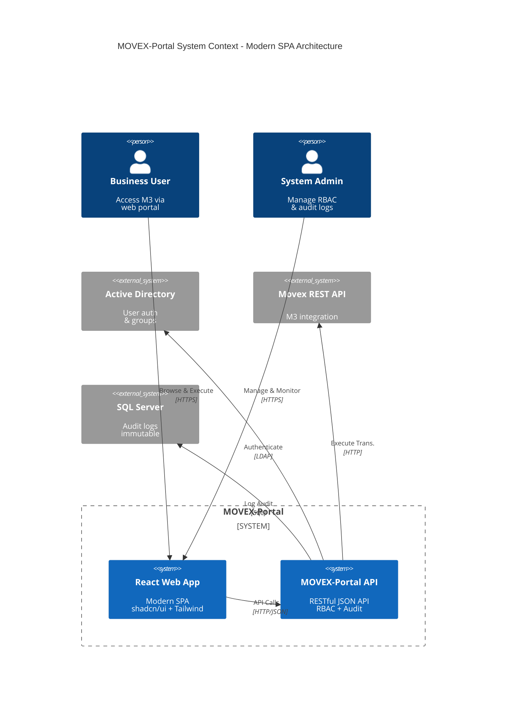
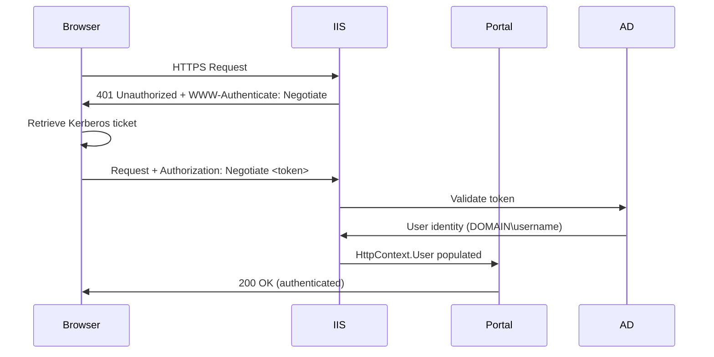
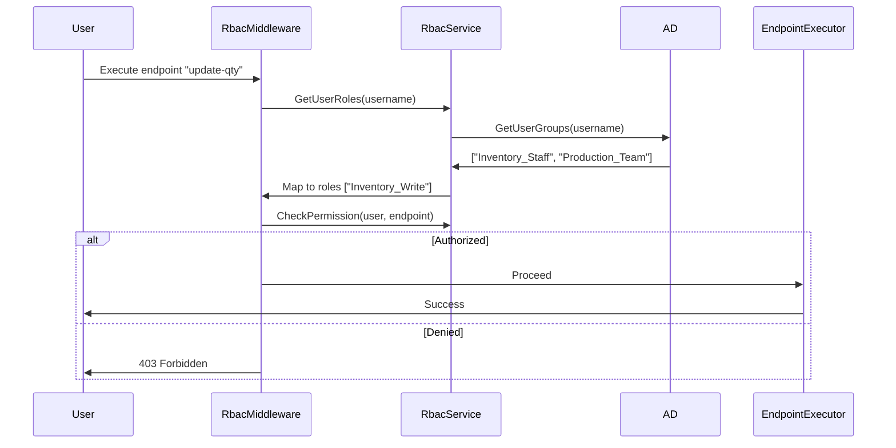
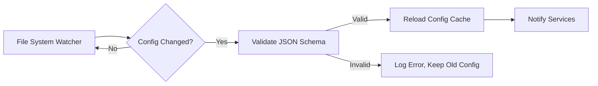
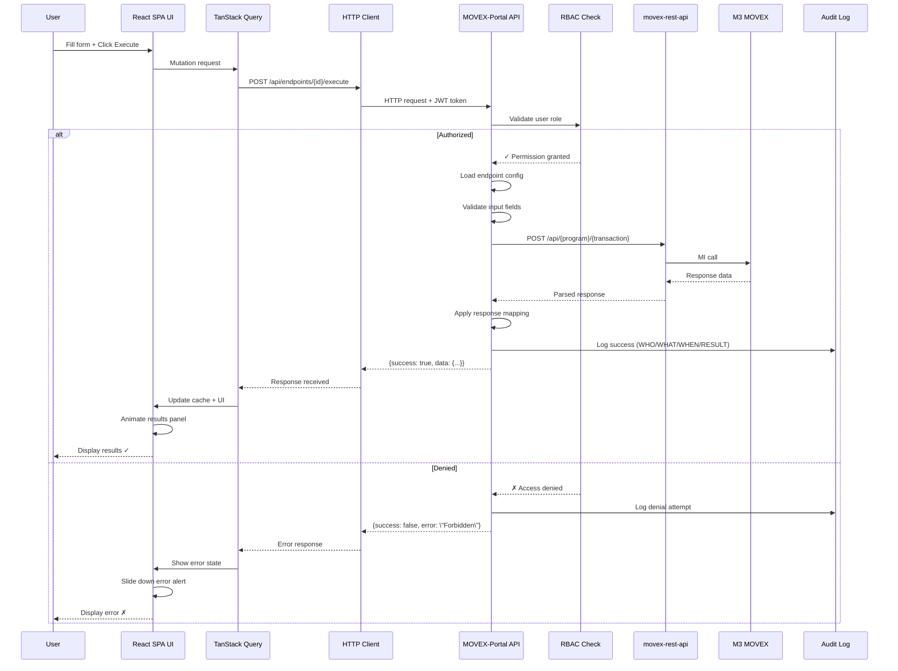

# MOVEX-Portal - System Architecture

**Last Updated**: 2026-02-09  
**Status**: Phase 1 - Foundation  
**Version**: 0.1.0 (Pre-Alpha)  
**UI Architecture**: React 18 + shadcn/ui + Tailwind CSS

## 🏗️ Architecture Overview

MOVEX-Portal is a **modern, secure, config-driven application** that provides seamless access to M3 MOVEX endpoints.
It consists of a **React SPA** and a **separate MOVEX-Portal API** that orchestrates RBAC, audit logging, and endpoint execution.

**Technology Stack**:
- **Frontend**: React 18 + TypeScript + shadcn/ui + Tailwind CSS (Modern SPA)
- **Backend**: MOVEX-Portal API (ASP.NET Core 8.0 RESTful JSON API)
- **Database**: SQL Server 2019 (Audit logs)
- **Authentication**: Windows AD + JWT tokens

### Design Principles

1. **Configuration Over Code** - Add new endpoints via JSON config, no deployment required
2. **Security First** - RBAC enforcement, comprehensive auditing, defense-in-depth
3. **Skills-Based Architecture** - Reusable patterns from centralized skills registry
4. **Modern UX** - React + shadcn/ui + Tailwind for professional, customizable interface
5. **Separation of Concerns** - Independent frontend SPA and backend API
6. **ISO 27001 Compliance** - Immutable audit trails, access controls, data protection

### Why React + shadcn/ui + Tailwind CSS?

**UX/UI Excellence** 🎨
- Modern, contemporary design (not generic Material Design)
- Fully customizable components (you own the code)
- Smooth animations & real-time feedback
- Responsive across all devices
- Lightweight bundle size (~95KB vs 280KB)

**Developer Experience** 👨‍💻
- Component reusability & maintainability
- TypeScript for type safety
- Tailwind CSS for rapid styling
- Hot Module Replacement (instant reload)
- Direct component customization (no theme API limitations)

**Scalability** 📈
- Independent frontend/backend teams
- Can add mobile apps, admin dashboards
- API-first design naturally supports multiple clients
- Easy to migrate to micro-frontends later

**Security** 🔒
- API-based architecture is inherently more secure
- JWT tokens for stateless authentication
- CORS + security headers prevent XSS/CSRF
- Audit controls remain the same strength

---

## 📊 Logical Architecture

### System Context Diagram (Improved)



### Container Architecture (Improved)

```mermaid
C4Container
  title MOVEX-Portal Containers - React Frontend + Portal API

    Person(user, "Business User")

    Container_Boundary(frontend, "React Frontend") {
      Container(ui, "shadcn/ui", "React + TS", "Flashy modern UI")
      Container(router, "React Router", "TypeScript", "Client navigation")
      Container(state, "Zustand", "TypeScript", "Global state")
      Container(query, "TanStack Query", "TypeScript", "Server state")
    }

    Container_Boundary(api, "MOVEX-Portal API") {
        Container(ctrl, "Controllers", "C#", "JSON endpoints")
        Container(middleware, "Middleware", "C#", "RBAC & Audit")
        Container(services, "Services", "C#", "Business logic")
    }

    System_Ext(ad, "Active Directory")
    System_Ext(m3api, "Movex REST API")
    ContainerDb_Ext(db, "SQL Server", "Audit DB")

    Rel(user, ui, "Interacts")
    Rel(ui, router, "Routes")
    Rel(ui, state, "State")
    Rel(query, ctrl, "HTTP/JSON")
    Rel(ctrl, middleware, "Pipeline")
    Rel(middleware, services, "Invokes")
    Rel(services, m3api, "Executes")
    Rel(middleware, ad, "Validates")
    Rel(middleware, db, "Logs")

    style frontend fill:#61dafb,stroke:#000,stroke-width:2px,color:#000
    style api fill:#68a063,stroke:#000,stroke-width:2px,color:#fff
```

---

## 🔧 Component Architecture

### Modern SPA + API Architecture

```
┌─────────────────────────────────────────────────────────────┐
│                    PRESENTATION LAYER                        │
│  • shadcn/ui Components (React 18 + TypeScript)             │
│  • Dynamic forms from endpoint config                        │
│  • Real-time form validation & feedback                      │
│  • Smooth animations & transitions                           │
└─────────────────────────────────────────────────────────────┘
                              ↓
┌─────────────────────────────────────────────────────────────┐
│                  STATE MANAGEMENT LAYER                      │
│  • Zustand (global state)                                   │
│  • TanStack Query (server state caching)                    │
│  • React Hook Form (form state)                             │
└─────────────────────────────────────────────────────────────┘
                              ↓
┌─────────────────────────────────────────────────────────────┐
│                      HTTP CLIENT LAYER                       │
│  • Axios with interceptors                                  │
│  • JWT token management                                     │
│  • Request/response logging                                 │
│  • Error handling & retry logic                             │
└─────────────────────────────────────────────────────────────┘
                              ↓ HTTP/JSON
┌─────────────────────────────────────────────────────────────┐
│                 MOVEX-PORTAL API LAYER                       │
│  • RESTful Controllers (C#)                                 │
│  • OpenAPI/Swagger documentation                            │
│  • Request validation (FluentValidation)                    │
└─────────────────────────────────────────────────────────────┘
                              ↓
┌─────────────────────────────────────────────────────────────┐
│                     MIDDLEWARE LAYER                         │
│  • JWT Authentication (stateless)                           │
│  • RbacMiddleware (permission enforcement)                  │
│  • AuditMiddleware (log all requests/responses)             │
│  • ExceptionMiddleware (error handling, masking)            │
└─────────────────────────────────────────────────────────────┘
                              ↓
┌─────────────────────────────────────────────────────────────┐
│                      SERVICES LAYER                          │
│  • EndpointExecutorService (generic-endpoint-executor)      │
│  • RbacService (rbac-endpoint-control)                      │
│  • AuditService (audit-logging-framework)                   │
│  • M3TransactionBuilder (m3-transaction-builder)            │
│  • M3ResponseParser (m3-response-parser)                    │
└─────────────────────────────────────────────────────────────┘
                              ↓
┌─────────────────────────────────────────────────────────────┐
│                   INFRASTRUCTURE LAYER                       │
│  • MovexApiClient (HTTP client for Movex REST API)         │
│  • ConfigurationService (endpoint registry, RBAC config)    │
│  • AuditRepository (SQL Server persistence)                 │
│  • AdAuthenticationService (Windows Auth wrapper)           │
└─────────────────────────────────────────────────────────────┘
```

### Frontend Layer - React Components

```typescript
// Component hierarchy for dashboard (shadcn/ui + Tailwind CSS)
<App>
  <header className="border-b">
    <NavigationMenu />  // shadcn/ui component
  </header>
  <div className="flex">
    <aside className="w-64 border-r">  // Tailwind sidebar
      <nav className="space-y-2 p-4">
        <Button variant="ghost">Endpoints</Button>
        <Button variant="ghost">Audit Logs</Button>
        <Button variant="ghost">Admin</Button>
      </nav>
    </aside>
    <main className="flex-1 p-6">
      <div className="grid grid-cols-3 gap-4">  // Tailwind grid
        <Card>  // shadcn/ui Card
          <CardHeader>
            <CardTitle>MMS175: Item Movement</CardTitle>
          </CardHeader>
          <CardContent>
            <Form {...form}>  // shadcn/ui Form
              <FormField name="itemNumber">
                <Input />  // shadcn/ui Input
              </FormField>
              <FormField name="warehouse">
                <Select>  // shadcn/ui Select
                  <SelectTrigger />
                </Select>
              </FormField>
            </Form>
          </CardContent>
        </Card>
      </div>
      <div className="mt-6">  // Results panel
        <Table>  // shadcn/ui Table
          <TableHeader>...</TableHeader>
          <TableBody>...</TableBody>
        </Table>
        <Alert variant="success">  // shadcn/ui Alert
          Transaction completed
        </Alert>
      </div>
    </main>
  </div>
</App>
```

### Key Components

#### 1. EndpointExecutorService
**Skill**: `generic-endpoint-executor`  
**Responsibilities**:
- Load endpoint definition from registry
- Validate user input against endpoint schema
- Build M3 transaction request
- Execute via Movex REST API
- Parse and return response

**Flow**:
```
User Input → Validate Fields → Check RBAC → Build Request → Execute → Parse Response → Return
```

#### 2. RbacService
**Skill**: `rbac-endpoint-control`  
**Responsibilities**:
- Map AD user to roles
- Check endpoint permissions
- Enforce risk-level restrictions
- Provide RBAC admin API

**Data Model**:
```json
{
  "user": "DOMAIN\\username",
  "roles": ["Inventory_Read", "Inventory_Write"],
  "allowedEndpoints": ["get-item-basic", "update-qty"],
  "restrictions": {
    "maxRiskLevel": "MEDIUM"
  }
}
```

#### 3. AuditService
**Skill**: `audit-logging-framework`  
**Responsibilities**:
- Log every endpoint execution
- Capture: user, timestamp, endpoint, input, output, result, duration
- Mask sensitive fields (passwords, PII)
- Provide queryable audit trail
- Generate compliance reports

**Audit Record Schema**:
```json
{
  "id": "uuid",
  "timestamp": "2026-02-04T10:30:00Z",
  "user": "DOMAIN\\jsmith",
  "endpoint": "update-item-qty",
  "action": "EXECUTE",
  "input": {"ITNO": "ITEM123", "WHLO": "WH01", "STQT": "***"},
  "output": {"success": true, "message": "Qty updated"},
  "status": "SUCCESS",
  "duration_ms": 234,
  "ip_address": "192.168.1.50",
  "hash": "sha256_hash_for_integrity"
}
```

#### 4. M3TransactionBuilder
**Skill**: `m3-transaction-builder`  
**Responsibilities**:
- Build M3 MI transaction payloads
- Apply field formatting rules
- Handle company code defaults
- Support optional/conditional fields

#### 5. M3ResponseParser
**Skill**: `m3-response-parser`  
**Responsibilities**:
- Parse M3 MI responses
- Map fields to display labels
- Format data types (dates, numbers)
- Extract error messages

---

## 🔐 Security Architecture

### Authentication Flow



### Authorization Flow



### Security Layers

| Layer | Control | Implementation |
|-------|---------|----------------|
| **Network** | IP Allowlist | IIS IP restrictions, internal network only |
| **Authentication** | Windows Auth | Active Directory, Kerberos/NTLM |
| **Authorization** | RBAC | Role-to-endpoint mappings, risk levels |
| **Transport** | TLS 1.3 | HTTPS certificate, HSTS enabled |
| **Application** | Input Validation | Schema-based validation, SQL injection prevention |
| **Data** | Field Masking | Auto-mask sensitive fields in logs |
| **Audit** | Immutable Logs | SHA-256 hashing, append-only SQL table |

---

## 📁 Configuration Architecture

### Endpoint Registry Structure

```json
{
  "endpoints": [
    {
      "id": "get-item-basic",
      "displayName": "Get Item Basic Info",
      "description": "Retrieve basic item master data",
      "m3Transaction": "MMS200MI.GetItmBasic",
      "requiredRole": "Inventory_Read",
      "riskLevel": "LOW",
      "category": "Inventory",
      "inputFields": [...],
      "outputFields": [...]
    }
  ]
}
```

### RBAC Configuration Structure

```json
{
  "roles": [
    {
      "name": "Inventory_Read",
      "description": "Read-only inventory access",
      "adGroups": ["SRX-Inventory-Users", "SRX-Warehouse-Staff"],
      "allowedEndpoints": ["get-item-basic", "search-items"],
      "maxRiskLevel": "LOW"
    },
    {
      "name": "Inventory_Write",
      "description": "Modify inventory data",
      "adGroups": ["SRX-Inventory-Managers"],
      "allowedEndpoints": ["update-qty", "move-item"],
      "maxRiskLevel": "MEDIUM"
    }
  ]
}
```

### Config Hot-Reload



---

## 🔄 Data Flow

### Endpoint Execution Flow (React + Portal API)



---

## 🚀 Deployment Architecture

### Physical Topology

```
┌─────────────────────────────────────────────────────────────┐
│                   INTERNAL NETWORK (VLAN 10)                │
│                                                             │
│  ┌─────────────┐        ┌──────────────┐                   │
│  │ User PC     │────────│ SRXWEBAPP1   │                   │
│  │ (Browser)   │ HTTPS  │ (IIS 10)     │                   │
│  └─────────────┘        │              │                   │
│                         │ - Portal SPA │                   │
│                         │ - Portal API │                   │
│                         │ - movex-rest-api │               │
│                         └──────┬───────┘                   │
│                                │ HTTP                       │
│                                │                            │
│                         ┌──────▼───────┐                   │
│                         │ SRXDB01      │                   │
│                         │ SQL Server   │                   │
│                         │ (Audit DB)   │                   │
│                         └──────────────┘                   │
│                                                             │
│  ┌──────────────┐        ┌──────────────┐                 │
│  │ SRXDC01      │        │ SRXMOVEX01   │                 │
│  │ (AD Domain   │        │ (M3 Server)  │                 │
│  │  Controller) │        │ Port 6300    │                 │
│  └──────────────┘        └──────────────┘                 │
└─────────────────────────────────────────────────────────────┘
```

### IIS Configuration

```
SRXWEBAPP1
├── Application Pool: MOVEX-Portal
│   ├── .NET CLR Version: No Managed Code
│   ├── Managed Pipeline: Integrated
│   ├── Identity: ApplicationPoolIdentity
│   └── Start Mode: AlwaysRunning
│
└── Website: MOVEX-Portal
    ├── Binding: https://*:443
    ├── SSL Certificate: srxwebapp1.srxglobal.com
    ├── Authentication:
    │   ├── Windows Authentication: Enabled
    │   ├── Anonymous Authentication: Disabled
    │   └── Providers: Negotiate, NTLM
    ├── Authorization:
    │   └── Allow: DOMAIN\Domain Users
    └── IP Restrictions:
        └── Allow: 192.168.1.0/24 (internal network)
```

---

## 📊 Performance Considerations

### Scalability Targets

| Metric | Target | Notes |
|--------|--------|-------|
| **Concurrent Users** | 50 | Typical: 10-15 active users |
| **Response Time** | < 2s | Endpoint execution + UI render |
| **Throughput** | 100 req/min | Peak load during shift changes |
| **Availability** | 99.5% | Planned maintenance windows |

### Caching Strategy

```
- Endpoint Registry: In-memory, hot-reload on change
- RBAC Config: In-memory, 5-minute TTL
- AD Group Memberships: In-memory, 15-minute TTL
- User Permissions: In-memory, 5-minute TTL
```

### Connection Pooling

```
- Movex REST API: HttpClient with SocketsHttpHandler (pooled)
- SQL Server: ADO.NET connection pooling (min 5, max 20)
```

---

## 🔍 Monitoring & Observability

### Logging Strategy

| Category | Level | Destination | Retention |
|----------|-------|-------------|-----------|
| **Audit Logs** | All | SQL Server | 7 years |
| **Application Logs** | Info+ | File (Serilog) | 90 days |
| **Error Logs** | Error+ | File + Email | 1 year |
| **Performance Metrics** | Debug | File | 30 days |

### Health Checks

```csharp
// Health check endpoints
/health              - Basic app health
/health/movex-api    - Movex REST API connectivity
/health/sql          - Audit database connectivity
/health/ad           - Active Directory connectivity
```

---

## 🧪 Testing Strategy

### Test Pyramid

```
                    ▲
                   ╱ ╲
                  ╱   ╲
                 ╱ E2E ╲        (5%) - Full user workflows
                ╱───────╲
               ╱         ╲
              ╱Integration╲     (15%) - Service interactions
             ╱─────────────╲
            ╱               ╲
           ╱  Unit Tests     ╲  (80%) - Component logic
          ╱───────────────────╲
```

### Test Coverage

- **Unit Tests**: Services, validators, parsers (>80% coverage)
- **Integration Tests**: Middleware, API clients, database (>60% coverage)
- **E2E Tests**: Critical user workflows (5 core scenarios)
- **Security Tests**: RBAC enforcement, audit logging, input validation

---

## 📚 Technology Stack

### Frontend (React SPA - Modern & Flashy)
- **React 18** - Component library & rendering engine
- **TypeScript 5** - Type safety for JavaScript
- **shadcn/ui** - Accessible component library (built on Radix UI)
- **Tailwind CSS 3.4+** - Utility-first CSS framework
- **Zustand** - Lightweight global state management
- **TanStack Query** - Server state caching & synchronization
- **React Router 6** - Client-side routing & navigation
- **Axios** - HTTP client with interceptors
- **React Hook Form** - Form handling & validation
- **Vite** - Lightning-fast build tool & dev server
- **Lucide React** - Icon library

### Backend (ASP.NET Core 8.0 API)
- **ASP.NET Core 8.0** - Web application framework
- **C# 12** - Backend programming language
- **OpenAPI/Swagger** - API documentation
- **Serilog** - Structured logging
- **Polly** - Resilience & retry policies
- **FluentValidation** - Input validation
- **Dapper** - SQL data access (micro-ORM)
- **System.Text.Json** - JSON serialization

### Infrastructure
- **IIS 10** - Web server (hosts React SPA + API)
- **Windows Server 2019** - Operating system
- **SQL Server 2019** - Audit database
- **Active Directory** - Authentication & authorization

---

## 🔗 Integration Points

### Movex REST API
- **Endpoint**: `http://srxwebapp1:5000`
- **Protocol**: HTTP/JSON
- **Authentication**: API Key
- **Timeout**: 30 seconds
- **Retry Policy**: 3 attempts with exponential backoff

### Active Directory
- **Domain**: `SRXGLOBAL.COM`
- **Protocol**: LDAP/Kerberos
- **Service Account**: `svc_movexportal`

### SQL Server
- **Server**: `SRXDB01`
- **Database**: `MovexPortal_Audit`
- **Authentication**: Windows Authentication
- **Connection String**: Encrypted in appsettings

---

## 🛡️ Compliance & Standards

### ISO 27001 Controls

| Control | Implementation |
|---------|----------------|
| **A.9.2.1** Access control policy | RBAC with AD groups |
| **A.9.4.1** Information access restriction | Role-to-endpoint mappings |
| **A.12.4.1** Event logging | Comprehensive audit trail |
| **A.12.4.3** Administrator logs | Admin actions logged separately |
| **A.18.1.5** Regulation compliance | 7-year audit retention |

### Security Best Practices

- ✅ OWASP Top 10 mitigation
- ✅ Input validation & sanitization
- ✅ SQL injection prevention
- ✅ XSS protection (Content Security Policy)
- ✅ CSRF protection (anti-forgery tokens)
- ✅ Secure headers (HSTS, X-Frame-Options)

---

## 📖 References

### Internal Documentation
- [Product Vision](00-product-vision.md)
- [Manufacturing Context](01-manufacturing-context.md)
- [Skills Registry](../../.github/skills/)
- [Movex REST API Docs](../../MOVEX/API-Integration/movex-rest-api/README.md)

### External Standards
- [ISO 27001:2013](https://www.iso.org/standard/54534.html)
- [OWASP ASVS](https://owasp.org/www-project-application-security-verification-standard/)
- [ASP.NET Core Security](https://docs.microsoft.com/en-us/aspnet/core/security/)

---

**Document Status**: ✅ Complete  
**Next Steps**: Begin MVP implementation (MMS175 endpoint)  
**Approved By**: IT Manager (Pending)
