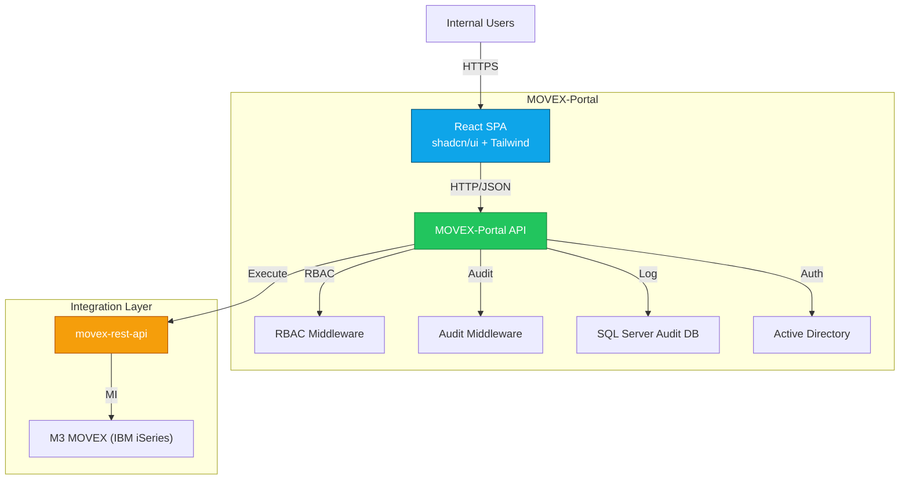

# System Architecture Diagram

```mermaid
flowchart TB
    User[Internal Users] -->|HTTPS| UI[React SPA<br/>shadcn/ui + Tailwind]

    subgraph Portal["MOVEX-Portal"]
        UI -->|HTTP/JSON| API[MOVEX-Portal API]
        API -->|RBAC| RBAC[RBAC Middleware]
        API -->|Audit| Audit[Audit Middleware]
        API -->|Log| SQL[SQL Server Audit DB]
        API -->|Auth| AD[Active Directory]
    end

    subgraph Integration["Integration Layer"]
        API -->|Execute| Movex[movex-rest-api]
        Movex -->|MI| M3["M3 MOVEX (IBM iSeries)"]
    end

    style UI fill:#0ea5e9,stroke:#0b4f6c,color:#fff
    style API fill:#22c55e,stroke:#15803d,color:#fff
    style Movex fill:#f59e0b,stroke:#b45309,color:#fff
```
