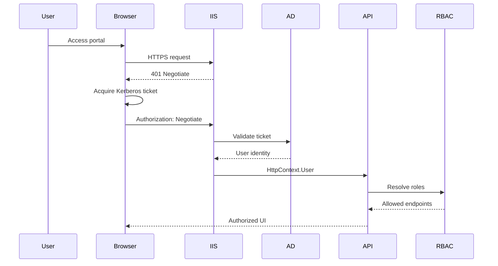

# Authentication & RBAC Flow

```mermaid
sequenceDiagram
    participant User
    participant Browser
    participant IIS
    participant AD
    participant API
    participant RBAC

    User->>Browser: Access portal
    Browser->>IIS: HTTPS request
    IIS-->>Browser: 401 Negotiate
    Browser->>Browser: Acquire Kerberos ticket
    Browser->>IIS: Authorization: Negotiate
    IIS->>AD: Validate ticket
    AD-->>IIS: User identity
    IIS->>API: HttpContext.User
    API->>RBAC: Resolve roles
    RBAC-->>API: Allowed endpoints
    API-->>Browser: Authorized UI
```
