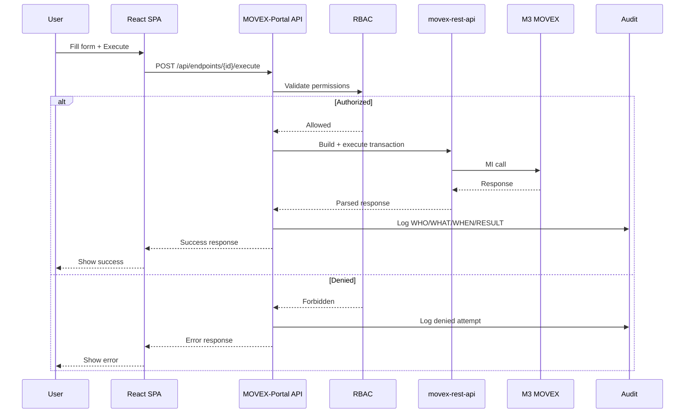

# Data Flow - Endpoint Execution

```mermaid
sequenceDiagram
    participant User
    participant UI as React SPA
    participant API as MOVEX-Portal API
    participant RBAC
    participant Movex as movex-rest-api
    participant M3 as M3 MOVEX
    participant Audit

    User->>UI: Fill form + Execute
    UI->>API: POST /api/endpoints/{id}/execute
    API->>RBAC: Validate permissions
    alt Authorized
        RBAC-->>API: Allowed
        API->>Movex: Build + execute transaction
        Movex->>M3: MI call
        M3-->>Movex: Response
        Movex-->>API: Parsed response
        API->>Audit: Log WHO/WHAT/WHEN/RESULT
        API-->>UI: Success response
        UI-->>User: Show success
    else Denied
        RBAC-->>API: Forbidden
        API->>Audit: Log denied attempt
        API-->>UI: Error response
        UI-->>User: Show error
    end
```
