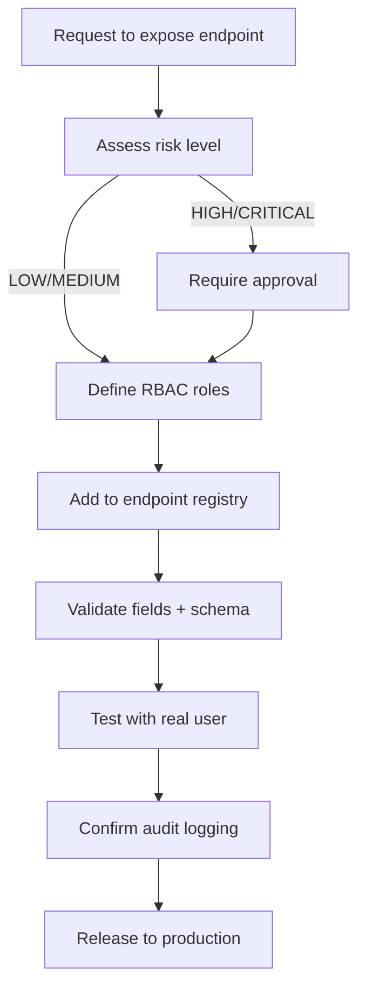

# Decision Tree - Expose Endpoint

```mermaid
flowchart TD
    Start[Request to expose endpoint] --> Risk[Assess risk level]
    Risk -->|LOW/MEDIUM| RBAC[Define RBAC roles]
    Risk -->|HIGH/CRITICAL| Approval[Require approval]
    Approval --> RBAC
    RBAC --> Config[Add to endpoint registry]
    Config --> Validate[Validate fields + schema]
    Validate --> Test[Test with real user]
    Test --> Audit[Confirm audit logging]
    Audit --> Release[Release to production]
```
