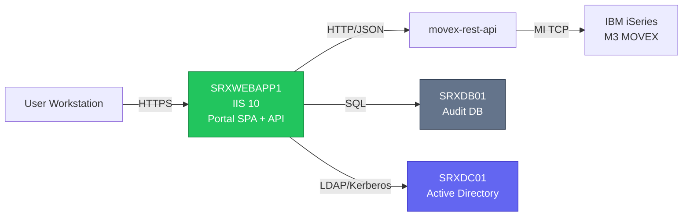

# Deployment Topology

```mermaid
flowchart LR
    UserPC[User Workstation] -->|HTTPS| SRXWEBAPP1[SRXWEBAPP1<br/>IIS 10<br/>Portal SPA + API]
    SRXWEBAPP1 -->|HTTP/JSON| MovexAPI[movex-rest-api]
    SRXWEBAPP1 -->|SQL| SQL[SRXDB01<br/>Audit DB]
    SRXWEBAPP1 -->|LDAP/Kerberos| AD[SRXDC01<br/>Active Directory]
    MovexAPI -->|MI TCP| M3[IBM iSeries<br/>M3 MOVEX]

    style SRXWEBAPP1 fill:#22c55e,stroke:#15803d,color:#fff
    style SQL fill:#64748b,stroke:#334155,color:#fff
    style AD fill:#6366f1,stroke:#4338ca,color:#fff
```
