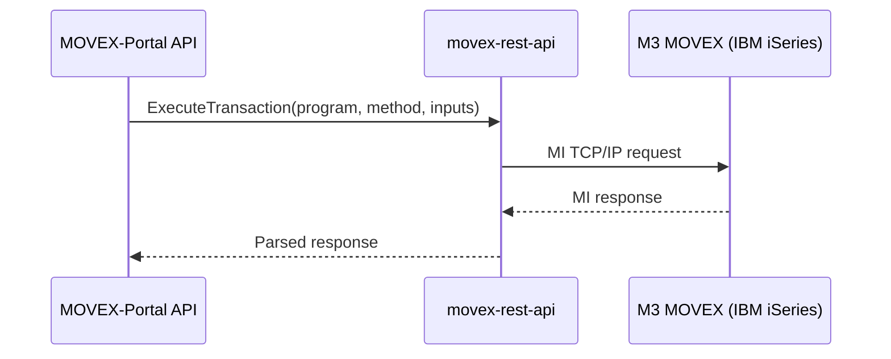

# Integration Sequence - Portal to M3

```mermaid
sequenceDiagram
    participant Portal as MOVEX-Portal API
    participant Movex as movex-rest-api
    participant M3 as M3 MOVEX (IBM iSeries)

    Portal->>Movex: ExecuteTransaction(program, method, inputs)
    Movex->>M3: MI TCP/IP request
    M3-->>Movex: MI response
    Movex-->>Portal: Parsed response
```
