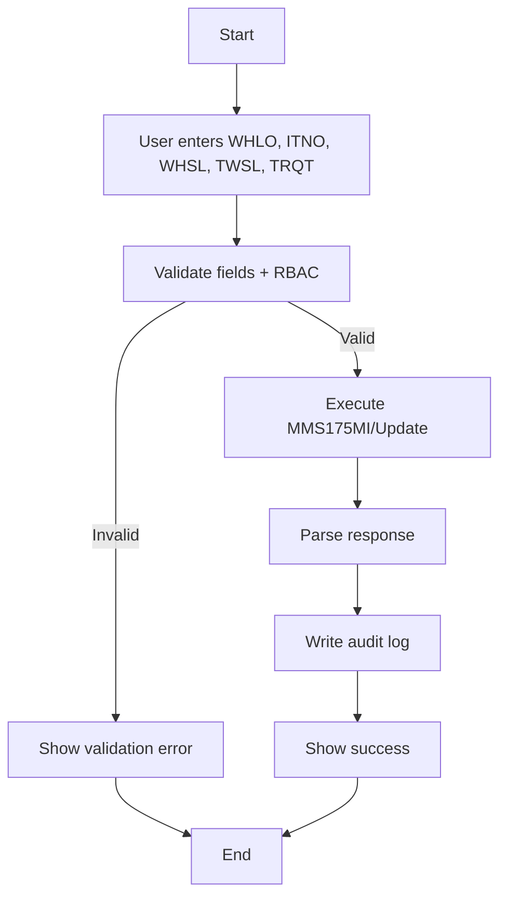

# Workflow Process - MMS175 Item Movement

```mermaid
flowchart TD
    Start[Start] --> Input[User enters WHLO, ITNO, WHSL, TWSL, TRQT]
    Input --> Validate[Validate fields + RBAC]
    Validate -->|Valid| Execute[Execute MMS175MI/Update]
    Validate -->|Invalid| Error[Show validation error]
    Execute --> Response[Parse response]
    Response --> Audit[Write audit log]
    Audit --> Done[Show success]
    Error --> End[End]
    Done --> End[End]
```
